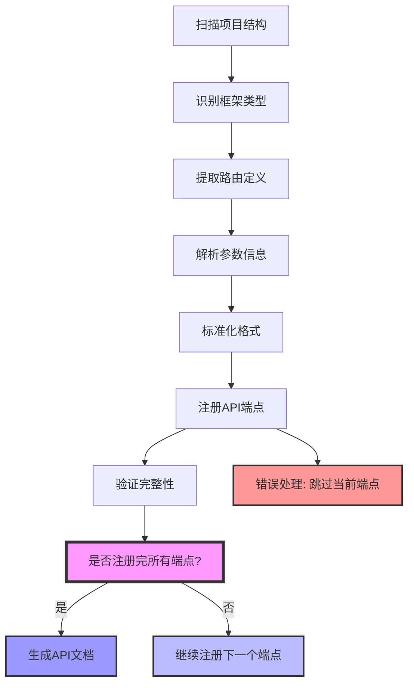

# API审计与文档生成技能指南

## 概述

本技能指导AI代理如何使用OpenAPI端点注册MCP服务来审计代码、注册API端点并生成完整的API文档报告。该技能目前仅支持单个API端点注册以及导出单一格式文档。生成文档将在所有API端点注册完成后进行。

## 核心工具

### 1. 端点注册工具 (`register_endpoint`)

**用途**

用于在代码审计过程中，将发现的 API 端点按统一规范进行注册，作为后续文档生成与接口资产管理的基础数据来源。


#### 参数规范（严格约束）

##### **基础信息**

**api_name** (必填)  
API所属业务名称，用于分组展示。  
约束：
- 必须为稳定业务名称（不可随意变化）
- 建议使用中文或清晰英文，如：用户管理API、OrderService

**description**  
API端点功能描述。  
约束：
- 必须基于代码真实语义，不允许臆造
- 建议一句话说明核心功能

**path** (必填)  
API路径，必须符合 RESTful 规范。  
约束：
- 路径参数必须使用 `{}`，如 `/users/{id}`
- 不允许出现具体值（如 `/users/123` ❌）
- 必须与代码路由定义一致

**method** (必填)  
HTTP方法，仅允许：
GET / POST / PUT / DELETE / PATCH

---

##### **请求参数（params）**

用于描述 query / path / header 参数。

字段结构：

| 字段 | 说明 | 约束 |
|------|------|------|
| name | 参数名 | 必须与代码一致 |
| in | 参数位置 | query / path / header |
| type | 类型 | string / number / integer / boolean / array / object |
| required | 是否必填 | true / false |
| description | 描述 | 基于代码语义 |
| default | 默认值 | 可选 |

---

**请求体（request_body）**

用于 POST / PUT / PATCH。

约束：
- 不可与 params 混用
- 必须完整展开字段结构
- 不允许仅写 object

**request_body_format**

推荐：
- application/json
- application/xml
- application/x-www-form-urlencoded
- multipart/form-data
- application/octet-stream

---

**请求示例（param_example）**

约束：
- 必须与参数定义一致
- 必须真实反映当前接口入参结构
- 不允许伪造字段
- 示例格式应与请求类型一致（可能是 JSON / 表单 / query string / 混合结构）

---

##### **响应定义**

**response_fields**

| 字段 | 说明 |
|------|------|
| name | 字段名 |
| type | 数据类型 |
| description | 描述 |
| required | 是否必返回 |
| example | 示例值 |

---

**response_format**
- application/json 等

**response_example**

约束：
- 必须来源于真实接口返回结构（代码或实际逻辑）
- 必须与 response_fields 描述保持一致（字段一致性校验）
- 示例内容必须可用于理解接口行为
- 示例格式需与 response_format 一致（可能是 JSON / XML / text / binary 等）


#### **示例**

```json
{
  "api_name": "用户管理API",
  "description": "获取单个用户信息",
  "path": "/users/{id}",
  "method": "GET",
  "params": [
    {
      "name": "id",
      "in": "path",
      "type": "integer",
      "required": true,
      "description": "用户ID"
    }
  ],
  "response_format": "application/json",
  "response_fields": [
    {
      "name": "id",
      "type": "integer",
      "required": true,
      "description": "用户ID",
      "example": 123
    },
    {
      "name": "name",
      "type": "string",
      "required": true,
      "description": "用户名",
      "example": "张三"
    }
  ],
  "response_example": "{\"id\":123,\"name\":\"张三\"}"
}
```

#### 强约束（必须遵守）

- ✅ **数据真实性**
  - 所有字段必须来源于代码分析
  - ❌ 禁止猜测 / 编造

- ✅ **完整性**
  - 必须注册所有发现的端点
  - 不允许遗漏

- ✅ **参数完整性**
  - 必须包含：类型 + 是否必填 + 描述
  - 尽可能补全默认值 / 示例

- ✅ **分层清晰**
  - `params` ≠ `request_body`
  - 不允许混用

- ✅ **顺序执行**
  - 按扫描顺序逐个注册
  - 不跳跃、不合并

- ✅ **可中断执行**
  - 支持逐步注册
  - 用户可随时暂停 / 继续
  - 允许分批处理大规模接口

- ✅ **上下文控制**
  - 批量注册过程中需主动压缩上下文
  - 避免重复输出已注册内容
  - 保持最小必要信息传递


---

### 2. 端点查询工具 (`list_endpoints`)

**用途**: 查看已注册的所有API端点，了解当前API资产状况。

**特点**: 无需参数，直接返回已注册端点列表。

**输出示例**:

```json
{
  "total": 5,
  "list": [
    {
      "api_name": "用户管理API",
      "path": "/users"
    },
    {
      "api_name": "用户管理API",
      "path": "/users/{id}"
    }
  ]
}
```

### 3. 文档生成工具 (`generate_docs`)

**用途**: 生成完整的API文档报告，支持Markdown格式。

**输出示例**:

```json
{
  "success": true,
  "message": "✅ 成功生成API文档，格式: markdown",
  "file_path": "/tmp/api_docs_123456/api_docs.md",
  "file_size": 2048,
  "timestamp": "2024-01-15 10:30:00"
}
```

## 审计流程



## 相关约束

* **如实注册**
  必须严格按照源代码中的定义注册所有 API 端点，包括路由、请求参数、响应字段及其类型等。
  不得擅自更改或省略任何字段信息。

* **必须注册所有端点**
  必须扫描并注册项目中所有 API 端点，包括：
  - 业务接口
  - 内部接口
  - 调试 / 测试接口（如存在）

不得遗漏任何可识别路由。


* **注册唯一性与覆盖规则**
  API 注册以 **method + path** 为唯一标识。

规则：
- 若相同 `method + path` 已存在
  → 允许重复注册
  → 新注册数据必须覆盖旧数据
- 覆盖时必须以“最新代码定义”为准


* **注册顺序**
  必须按照扫描顺序逐个注册。
  不允许跳跃、重排或批量合并注册。

* **完整性验证**
  在生成文档前必须验证：
  - path 是否完整
  - method 是否存在
  - params 是否结构完整
  - request_body 是否完整（如存在）
  - response_fields 是否完整

任何缺失都视为注册不完整。

* **错误处理与容错**
  单个端点注册失败时：
  - 必须记录失败原因
  - 必须跳过该端点继续执行
  - 不得中断整体流程

* **逐个扫描与逐个注册**
  每个端点必须完成：
  “解析 → 注册 → 校验”
  才能进入下一个端点。

* **暂停与继续**
  在端点注册过程中，如果被迫暂停注册流程。暂停后，用户可以在之后继续注册未处理的端点，而无需重新开始整个过程。

* **参数完整性**
  参数必须尽可能完整提取，包括：
  - 类型（type）
  - 是否必填（required）
  - 默认值（default）
  - 参数位置（in）

必须基于代码解析结果，不允许猜测。


* **代码理解能力**
  必须基于源码进行语义解析，包括：
  - 路由定义
  - handler 函数签名
  - 注解 / 标签信息

禁止基于经验推断接口结构。


* **上下文压缩**
  在大规模注册过程中：
  - 允许压缩历史上下文
  - 避免重复输出已注册内容
  - 保留最小必要状态信息（endpoint summary）

---

* **②注册完成前禁止生成文档**
  ❌ 禁止在以下情况调用 generate_docs：
   - 尚未完成全部端点注册
   - 仍在分页/分批处理中
   - 存在未处理的路由定义

---

## 代码审计策略

### 识别API端点的模式

**Python (Flask/Django/FastAPI)**:

```python
# Flask
@app.route('/users', methods=['GET'])
def get_users():
    pass

# FastAPI
@app.get("/items/{item_id}")
async def read_item(item_id: int):
    pass
```

**JavaScript/TypeScript (Express/NestJS)**:

```javascript
// Express
app.get('/api/users', (req, res) => {
    // ...
});

// NestJS
@Get('users/:id')
findOne(@Param('id') id: string) {
    // ...
}
```

**Go (Gin/Echo)**:

```go
// Gin
router.GET("/users", getUsers)

// Echo
e.GET("/users/:id", getUser)
```

**Java (Spring Boot)**:

```java
// Spring Boot
@RestController
@RequestMapping("/users")
public class UserController {

    @GetMapping
    public List<User> getUsers() {
        // ...
    }

    @GetMapping("/{id}")
    public User getUser(@PathVariable("id") Long id) {
        // ...
    }
}
```

### 参数提取策略

1. **路径参数**: `/users/{id}` → `id: path parameter`
2. **查询参数**: `?name=value` → `name: query parameter`
3. **请求体**: `@RequestBody` → `body parameter`
4. **头部参数**: `@RequestHeader` → `header parameter`

## 最佳实践

### 1. 审计顺序

```
扫描项目结构 → 识别框架类型 → 提取路由定义 →
解析参数信息 → 标准化格式 → 注册 →
验证完整性 → 生成文档
```

### 2. 错误处理

* 遇到解析错误时，跳过当前端点继续处理。
* 注册失败时记录详细原因。
* 提供可选的参数默认值。

### 3. 命名规范

* `api_name`: 使用业务领域命名，如"订单管理API"
* `description`: 简明描述端点功能
* `path`: 遵循RESTful约定，使用复数名词
* `param_type`: 根据实际使用场景选择

## 应用场景

### 场景一: 新项目API文档生成

1. 审计所有源代码中的API端点。
2. 一次性注册所有发现的端点。
3. 生成完整的API文档报告。
4. 将文档集成到项目文档中。

### 场景二: 现有项目API资产盘点

1. 扫描项目历史代码。
2. 比对已注册端点和实际代码端点。
3. 更新缺失的API注册。
4. 生成最新的API资产清单。

### 场景三: 微服务接口规范检查

1. 检查多个服务的API一致性。
2. 识别不符合规范的接口。
3. 生成标准化的接口文档。
4. 提供改进建议。

## 质量保证

### 验证检查清单

* [ ] **API名称规范性**
  是否准确映射业务功能，且具备稳定语义（避免临时命名或技术命名）

* [ ] **HTTP方法合理性**
  是否符合语义规范：
  - GET：查询资源
  - POST：创建资源
  - PUT：全量更新
  - PATCH：部分更新
  - DELETE：删除资源

* [ ] **路径参数规范性**
  路径参数是否使用标准格式 `{param_name}`
  且不存在具体值（如 `/users/123` ❌）

* [ ] **必填参数标识完整性**
  所有必填参数是否明确标记 `required: true`

* [ ] **参数类型准确性**
  参数类型是否符合实际代码定义：
  `string / number / integer / boolean / array / object`

* [ ] **响应示例一致性**
  response_example 是否：
  - 与 response_fields 一致
  - 无缺失字段
  - 无虚构字段
  - 能真实反映接口返回结构


## 故障排除

### 常见问题

1. **注册失败**: 检查API名称和路径是否包含特殊字符。
2. **参数解析错误**: 确保参数类型符合支持的类型列表。
3. **文档生成失败**: 检查临时目录权限。
 
